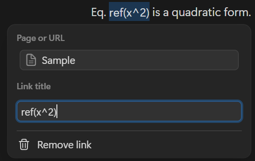
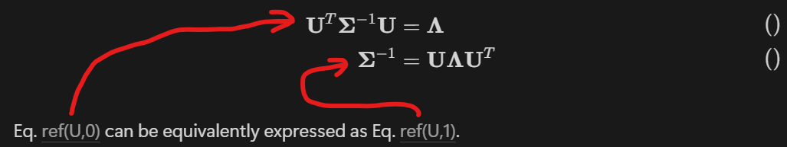
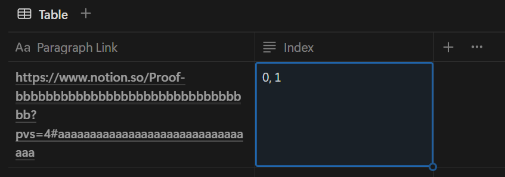
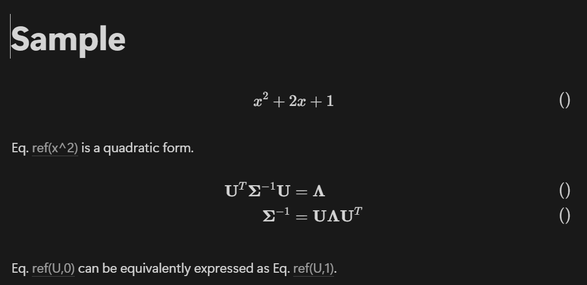
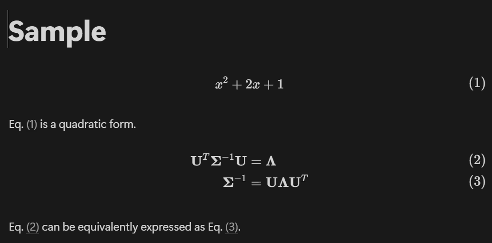

# Notion-Eq

**An equation numbering tool for Notion.**

- Automatically adds equation numbers to LaTeX blocks in Notion documents.
- Automatically replaces equation references with corresponding numbers (like LaTex's `\eqref`).

## Getting Started

### Prepare Your Notion Environment

1. Obtain a integration token.

1. Prepare the target Notion page and gets its Page ID.

1. Set up the [AlignEqRefs database](#aligneqrefs-database) and get its Database ID.

### Installation

1. Install the package:

   ```shell
   npm install @suzu-sys/notion-eq
   ```

1. Create a `.env` file and add the following:

   ```dotenv
   NOTION_TOKEN=*********************
   PAGE_ID=*********************
   ALIGN_EQ_REFS_DB_ID=*********************
   ```

### Usage

#### 1. Add Equation Numbers

Use `\tag{}` or `\tag{<digits>}` in your LaTeX block to mark equations for numbering. Any existing number will be replaced with the correct number automatically.

- Single numbered equation:

  ```tex
  x^2 + 2x + 1 \tag{}
  ```

- Multiple numbered equations:

  ```tex
  \begin{align}
  \mathbf U^T\mathbf \Sigma^{-1}\mathbf U &= \mathbf\Lambda\tag{} \\
  \mathbf\Sigma^{-1} &= \mathbf U\mathbf\Lambda\mathbf U^T\tag{}
  \end{align}
  ```

#### 2. Reference Equations

To reference a numbered equation, link to the equation block from a text block. The link title does not affect numbering.



If the equation block contains multiple numbered equations, register the referencing text block in the AlignEqRefs database.





#### 3. Run the Tool

```shell
notion-eq
```

- Before
  
- After
  

## .env Parameters

| Parameter              | Description                                            |
| ---------------------- | ------------------------------------------------------ |
| `NOTION_TOKEN`         | Your Notion integration token                          |
| `PAGE_ID`              | The ID of the Notion page to process.                  |
| `ALIGN_EQ_REFS_DB_ID`  | The ID of the AlignEqRefs database.                    |
| `EQ_PREFIX` (Optional) | Prefix of equation number in text blocks. Default: `(` |
| `EQ_SUFFIX` (Optional) | Suffix of equation number in text blocks. Default: `)` |

> [!NOTE] > `EQ_PREFIX` and `EQ_SUFFIX` are only applied to equation numbers displayed in text blocks, not inside LaTeX blocks.

Page and database IDs are 32-character alphanumeric strings, found at the end of a Notion page or database URL.

| Type     | URL and ID part                                                                                     |
| -------- | --------------------------------------------------------------------------------------------------- |
| Page     | h<!---->ttps://w<!---->ww.notion.so/Sample-Page-<ins>9a3f0c7d5b8e1f24c6d07b1e4f3a2d8c</ins>?pvs=... |
| Database | h<!---->ttps://w<!---->ww.notion.so/<ins>0f9b3d7ca1e45f28bdc07e2f6a3c9d14</ins>?v=...               |

## AlignEqRefs Database

The AlignEqRefs database is used to handle references to individual equations within a multi-equation block.

| Property         | Type  | Format                                                                    | Example Value                                       |
| ---------------- | ----- | ------------------------------------------------------------------------- | --------------------------------------------------- |
| `Paragraph Link` | Title | Link to the referencing text block. Link title does not affect numbering. | [Link](https://github.com/SuzuSys/notion-eq#readme) |
| `Index`          | Text  | Comma-separated list of `\tag{}` indices (0-based) in the equation block  | 1,0,1                                               |


